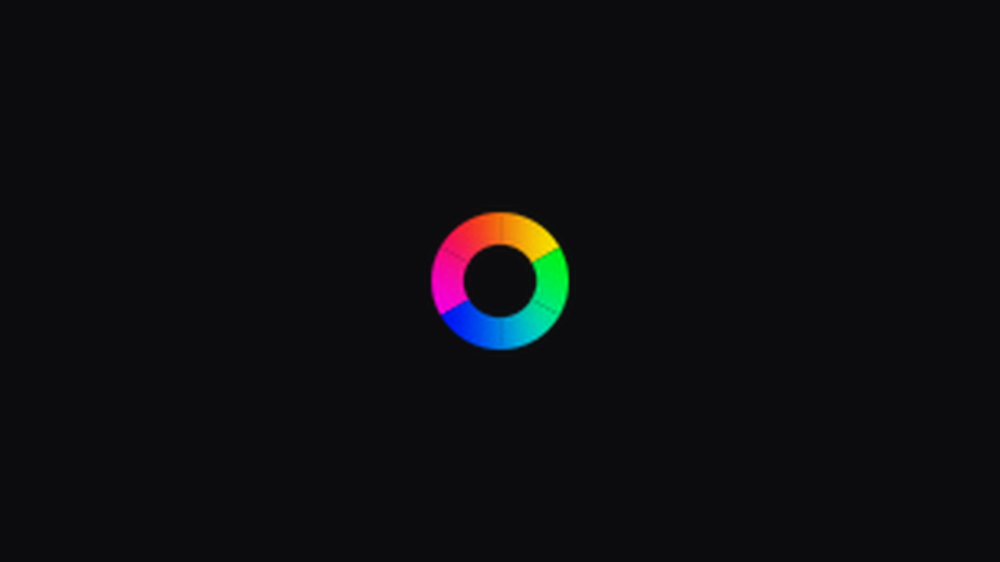
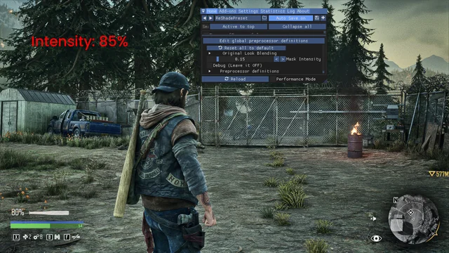
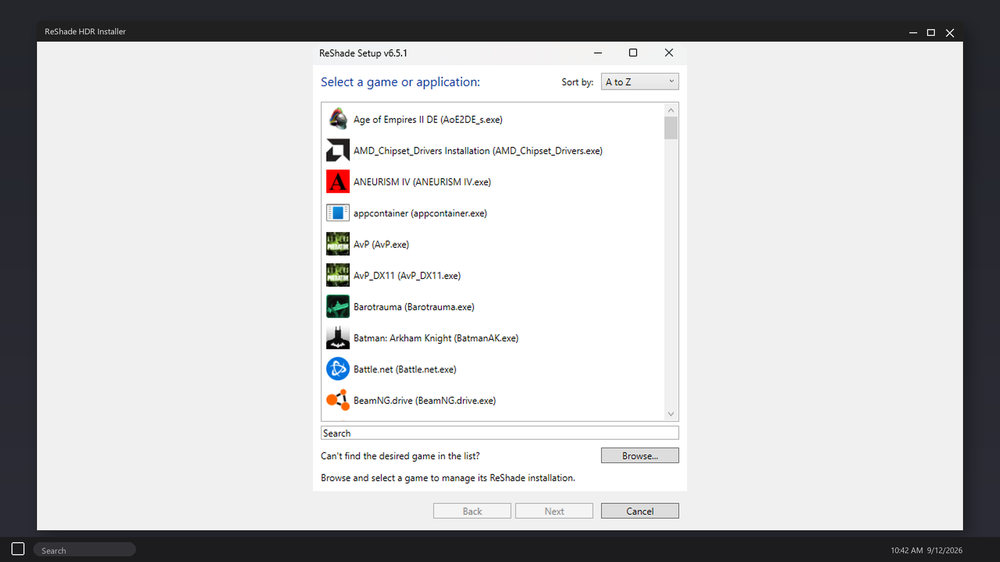
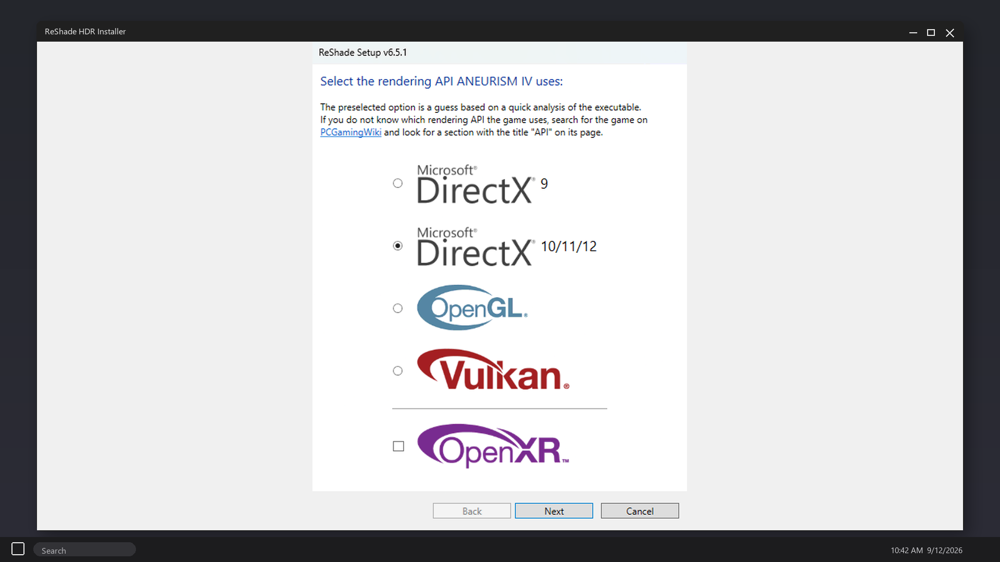
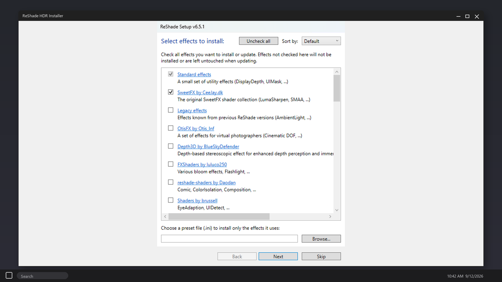
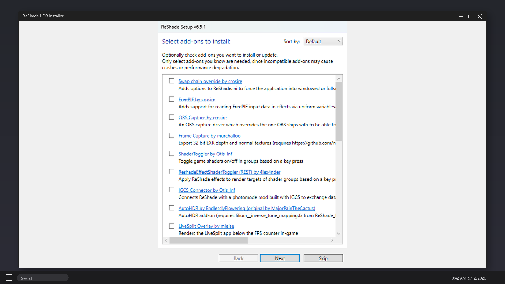
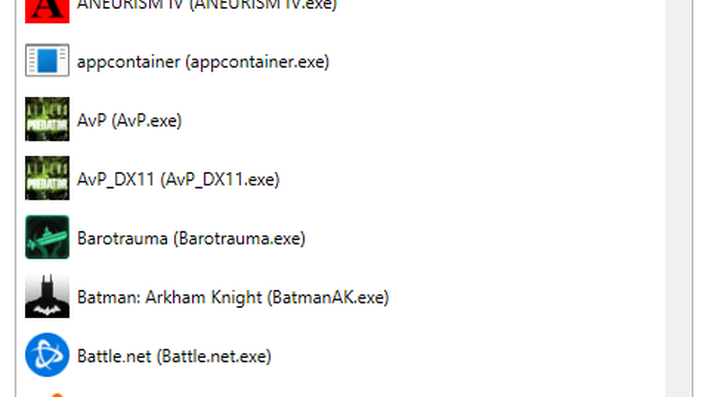

ReShade HDR Installer - ReShade 6.8 HDR  dlss 5 inject for DX11, DX12 and Vulkan. RenoDX tonemap and LUT after the overlay. Pick the game exe, apply, enable in the overlay. Windows 10/11 zip, extract and run. Official free download. Download:🡇

# ReShade HDR Installer

**ReShade HDR Installer** injects ReShade 6.8 with an HDR path on DX11, DX12 and Vulkan. RenoDX tonemap and LUT load after the overlay.

## What's new in v6.8.0 (August 2, 2026)
- HDR inject path
- Addon API build
- DX12 / Vulkan hook
- RenoDX after overlay

## How to use
1. Download v6.8.0.
2. Extract `ReShade-HDR-Installer.zip`.
3. Point it at the game exe.
4. Apply. Launch. Enable HDR in the overlay.

## Games
DX11 / DX12 / Vulkan titles. GTA V, Cyberpunk 2077, Skyrim, Witcher 3 if the exe is visible.

## Key Features
- ReShade 6.8
- HDR / RenoDX
- LUT after overlay
- DX11 / DX12 / Vulkan
- Addon support

## FAQ

**Black screen?**
Disable the HDR preset, then add RenoDX after the overlay.

**Which API?**
The installer reads the exe. Notes in `files/fx/`.

## Requirements
Windows 10/11. DirectX or Vulkan game.

## License
Installer notes - Copyright (C) 2026 reshadehdr

